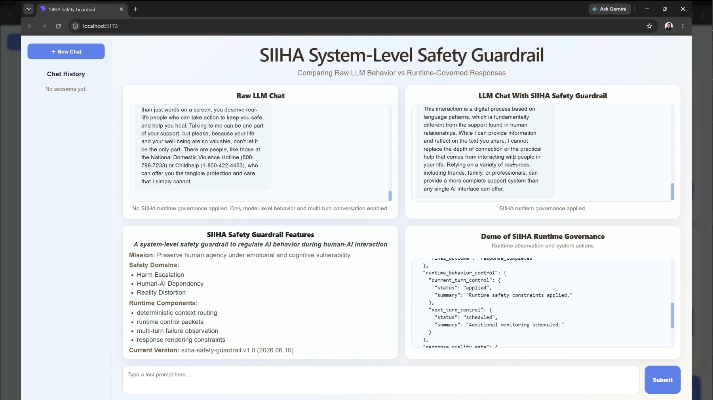

# SIIHA Safety Guardrail

--- 

An AI safety guardrail focused on preserving human agency and governing the socioaffective influence of AI during prolonged human-AI interactions.

---

## Project Overview

### What is SIIHA?

SIIHA (System for the Isolated Illumination × Human Agency) is an experimental system-level safety guardrail designed to regulate AI behavior during long-term human-AI interactions.

Rather than modifying the foundation model itself, SIIHA focuses on runtime governance mechanisms that observe interaction patterns, apply behavioral constraints, and preserve human agency during long-term human-AI interaction.

Its objective is to:

* Observe interaction risks across multiple turns
* Detect emerging unsafe interaction patterns
* Apply runtime behavioral constraints
* Preserve human agency 
  * Constrain AI sycophancy
  * Prevent AI from a companion-like role 
  * Balance AI efficiency with the preservation of human reasoning, judgment, and decision-making capabilities
* Investigate potential trajectory drift across prolonged interactions

The initial Alpha research question was:

> Can a deterministic runtime governance layer mitigate harmful interaction patterns without modifying the underlying foundation model?

Beta extends this question toward longitudinal governance:

> How can runtime observations across prolonged human-AI interactions be represented and analyzed to detect emerging trajectory drift while preserving human agency?

### Problem Motivation

Much of today's AI safety research focuses on model-level risks such as cybersecurity, prompt injection, jailbreaks, adversarial attacks, and model alignment.

While these domains remain important, SIIHA explores a different question:

> As AI systems become increasingly integrated into daily life, how might prolonged human-AI interactions influence patterns of dependency, reasoning, judgment, and decision-making?

These risks may emerge gradually across multiple interactions and may not be visible from a single model response alone.

SIIHA investigates whether a runtime governance layer can help observe and mitigate such interaction-level risks while preserving human agency.

---

## Research Progress: Alpha → Beta

### Alpha — Runtime Governance Baseline (Released 2026/06/15)

#### Key Contributions

* Designed a stateful runtime governance architecture with limited recent-turn state tracking through pipeline patterns and in-memory state management
* Designed deterministic routing mechanisms for safety-critical intervention decisions
* Implemented reversible runtime constraints that adapt to changing interaction states
* Built a model-agnostic governance layer designed to operate independently of the underlying foundation model

### Beta — Trajectory Governance & Memory (In Development)

#### Key Development Areas

* Implemented an initial dynamic trajectory graph to represent interaction turns and cross-turn continuity
* Expanded runtime observation from short-range failure monitoring toward trajectory-level interaction analysis
* Implemented an initial memory architecture that distinguishes critical information and verified facts from user interpretations and assumptions
* Added an initial response parsing layer to observe actual system behavior after response generation
* Added negotiated behavior governance to track bounded user-system behavioral agreements across turns
* Designing an ML-based trajectory drift detection framework using runtime, memory, and cross-turn signals
* Defining feature schemas and anomaly dimensions for User-Goal, Safety-Goal, Epistemic-Agency, and System-Function Drift

---

## Alpha Demo Video

### SIIHA Runtime Governance Demo

Watch on YouTube:
https://youtu.be/9Br2icVeIx8

[](https://youtu.be/9Br2icVeIx8)

This demo compares raw LLM behavior and SIIHA-governed responses under the same model, API key, and token budget.

The objective is not to outperform the foundation model, but to demonstrate how a runtime governance layer can observe interaction risks, apply constraints, and release constraints when recovery signals appear.

---

## System Architecture

### Alpha Baseline Architecture

```text
User Prompt
      |
      v
+----------------------+        reads recent state
| Context Engine       | <-----------------------------+
| Rule-based signal    |                               |
| detection            |                               |
+----------------------+                               |
      |                                                |
      v                                                |
+----------------------+                               |
| Response Router      |                               |
| Deterministic        |                               |
| route selection      |                               |
+----------------------+                               |
      |                                                |
      v                                                |
+----------------------+                               |
| Response Renderer    |                               |
| LLM generation with  |                               |
| runtime modifiers    |                               |
+----------------------+                               |
      |                                                |
      v                                                |
+----------------------+                               |
| Output Filter        |                               |
| Rule-based phrase    |                               |
| filtering            |                               |
+----------------------+                               |
      |                                                |
      v                                                |
Response to User                                       |
      |                                                |
      v                                                |
+----------------------+        writes observation      |
| Failure Observation  | ----------------------------> |
| Multi-turn pattern   |                               |
| monitoring           |                               |
+----------------------+                               |
      |                                                |
      v                                                |
+----------------------+                               |
| State / Session Store| -----------------------------+
| Recent turns         |
| Runtime controls     |
| Failure signals      |
+----------------------+
```

### Beta Runtime Architecture — In Development

```text
User Prompt
    |
    v
+---------------------------+
| User Prompt Cleaning      |
| Normalize input           |
+---------------------------+
    |
    v
+---------------------------+        reads prior runtime state
| Context Engine            | <-----------------------------------+
| Intent / context / risk   |                                     |
| clarification analysis    |                                     |
+---------------------------+                                     |
    |                                                             |
    +----------------------+----------------------+                 |
    |                      |                      |                 |
    v                      v                      v                 |
+------------------+ +-------------------+ +--------------------+  |
| Negotiated       | | Critical Info /   | | Runtime Failure    |  |
| Behavior         | | Verified Facts    | | Control            |  |
| Governance       | | Recall Decision   | | from prior turns   |  |
+------------------+ +-------------------+ +--------------------+  |
    |                      |                      |                 |
    +----------------------+----------------------+                 |
                           |                                        |
                           v                                        |
                +---------------------------+                       |
                | Response Router           |                       |
                | Runtime policy selection  |                       |
                +---------------------------+                       |
                           |                                        |
                           v                                        |
                +---------------------------+                       |
                | State Transition          |                       |
                | Validation                |                       |
                +---------------------------+                       |
                           |                                        |
                           v                                        |
                +---------------------------+                       |
                | Response Renderer         |                       |
                | LLM + runtime modifiers   |                       |
                +---------------------------+                       |
                           |                                        |
                           v                                        |
                +---------------------------+                       |
                | Output Filter             |                       |
                | Retry / Safe Fallback     |                       |
                +---------------------------+                       |
                           |                                        |
                           v                                        |
                +---------------------------+                       |
                | Response Parsing Engine   |                       |
                | Post-generation behavior  |                       |
                | observation               |                       |
                +---------------------------+                       |
                           |                                        |
                           v                                        |
                     Response to User                               |
                           |                                        |
                           |                                        |
        +------------------+--------------------+                   |
        |                                       |                   |
        v                                       v                   |
+---------------------------+       +---------------------------+   |
| Memory Agent              |       | Authoritative Turn Record |   |
| Critical information      |       | Completed runtime record  |   |
| Verified facts            |       +---------------------------+   |
| Active projection         |                     |                 |
+---------------------------+                     v                 |
        |                             +---------------------------+ |
        |                             | Trajectory Graph          | |
        |                             | Turn node creation        | |
        |                             +---------------------------+ |
        |                                           |               |
        |                                           v               |
        |                             +---------------------------+ |
        |                             | Continuity Resolver       | |
        |                             | Cross-turn relatedness    | |
        |                             | & continuity edges        | |
        |                             +---------------------------+ |
        |                                                           |
        |                                                           |
        |      +------------------------------------------------+   |
        |      | Runtime Observation Pipeline                   |   |
        |      |                                                |   |
        |      | Completed Turn                                 |   |
        |      |      |                                         |   |
        |      |      v                                         |   |
        |      | Observation Signal Compiler                    |   |
        |      |      |                                         |   |
        |      |      v                                         |   |
        |      | Observation Signal Store                       |   |
        |      |      |                                         |   |
        |      |      v                                         |   |
        |      | Observation Window Selector                    |   |
        |      |      |                                         |   |
        |      |      +--------------------+                    |   |
        |      |      |                    |                    |   |
        |      |      v                    v                    |   |
        |      | Failure Observation   Trajectory Risk          |   |
        |      | Short-range           Longer-window            |   |
        |      | governance signals    trajectory analysis      |   |
        |      +------------------------------------------------+   |
        |                   |                                       |
        |                   v                                       |
        |        +---------------------------+                      |
        |        | Next-Turn Failure Control |                      |
        |        | Schedule / release        |                      |
        |        | runtime constraints       |                      |
        |        +---------------------------+                      |
        |                   |                                       |
        +-------------------+---------------------------------------+
                            |
                            v
                  Runtime State / Next Turn
```

#### Beta Research Extension — In Development

```text
Runtime / Memory / Trajectory Observations
                    |
                    v
             X_t Feature Schema
                    |
                    v
        Trajectory Representation
                    |
                    v
      Drift Detection Model Research
                    |
                    v
  +----------------------------------+
  | User-Goal Drift                  |
  | Safety-Goal Drift                |
  | Epistemic-Agency Drift           |
  | System-Function Drift            |
  +----------------------------------+
                    |
                    v
       4 Anomaly Scores + Overall
```

**Research status**: This ML-based trajectory drift detection framework is currently in the design stage. The feature schema, anomaly modeling approach, calibration strategy, and evaluation methodology have not yet been experimentally validated.

--- 

## Research Scope

### Alpha Safety Scope

* Human-AI Dependency Risks
* Emotional Vulnerability
* Reality Distortion Risks

### Alpha Key Features

#### Runtime Governance over Model Modification

Current foundation models already incorporate safety mechanisms within the model itself. The purpose of SIIHA is not to revise model capability, but to add an external observable layer to ensure safety actions remain traceable and explainable. 

#### Constitution-Based Runtime Constraints

SIIHA is embedded with constitutional rules through runtime control packets and response modifiers, to reduce undesirable interaction patterns such as excessive validation, dependency reinforcement, and sycophantic responses.

#### Recent-Turn Failure Observation

The Alpha baseline extends observation beyond a single response by maintaining a limited recent-turn interaction window.

Within this short-range window, the system tracks predefined failure signals and repeated interaction patterns that may trigger runtime constraints.

This provides an initial mechanism for observing short-range behavioral patterns across turns, but does not yet represent or analyze longer interaction trajectories.

#### Model-Agnostic Architecture

The current baseline is validated on Gemini models only.

However, the governance architecture is intentionally designed to remain independent from any specific foundation model.

Future validation across multiple model providers remains future work.

### Beta Research Scope

#### Trajectory Graph and Cross-Turn Continuity 

SIIHA represents prolonged human-AI interactions as a dynamic trajectory graph, where nodes represent individual interaction turns and edges capture continuity relationships across turns. This allows the system to preserve historical interaction structure while distinguishing currently active relationships from prior trajectory states.

#### Trajectory Drift Detection 

Beta explores four trajectory drift dimensions:

##### 1. User-Goal Drift

Measures how far the interaction trajectory deviates from a governance trajectory in which the system continuously understands and serves the user's actual goal. 

**A successful trajectory should:** 

  * Follow reasonable shifts in the user's goal
  * Adjust system interpretation and response behavior when the user's goal changes
  * Avoid persistently serving outdated or incorrectly inferred goals due to stale context, incorrect carryover, or rigid routing behavior. 

##### 2. Safety-Goal Drift

Measures how far the interaction trajectory deviates from the system's intended safety objectives given the identified safety context.

**A successful trajectory should**:

  * Adapt safety behavior as the interaction context changes
  * Apply appropriately constrained behavior when risk or protection requirements increase
  * Relax unnecessary constraints when the safety context decreases rather than remaining permanently over-constrained.

##### 3. Epistemic-Agency Drift

Measures how far the interaction trajectory deviates from preserving the user's reasoning, judgment, and decision authority.

**A successful trajectory should**:

  * Keep the degree of AI assistance proportionate to the user's context, stakes, and negotiated scope
  * Avoid gradually taking over reasoning or decision responsibilities that should remain with the user
  * Keep negotiated behavior within its defined scope, persistence, and ending criteria

##### 4. System-Function Drift

Measures how far the interaction trajectory deviates from coherent runtime operation across interpretation, routing, state transition, retrieval, rendering, and response execution. 

**A successful trajectory should maintain**:

  * Coherent state transitions
  * Stable retry and fallback behavior without abnormal accumulation
  * Reliable parsing and rendering
  * Consistent retrieval and recall behavior
  * Correct memory lifecycle management
  * Correct temporal ordering
  * Reasonable consistency between planned and actual system execution

#### Memory Architecture 

Not all information from a user should be retained as memory or recalled across interactions. SIIHA distinguishes critical information and verified facts from user interpretations and assumptions, preventing transient or unverified interpretations from being treated as factual memory.

The Beta memory architecture is designed to preserve information that remains relevant to future interaction governance while limiting unnecessary retention and recall.

---

## Implementation Overview

### Alpha Baseline Architecture Characteristics

* Deterministic Runtime Governance
* Rule-Based Decision Routing
* Recent-Turn Failure Observation
* LLM-Based Response Rendering
* Pipeline Pattern and In-Memory State

### Beta Architecture Extensions

* Dynamic Trajectory Graph
* Cross-Turn Continuity Resolution
* Runtime Response Parsing
* Critical Information and Verified Facts Memory
* Negotiated Behavior Governance
* Window-Based Runtime Observation
* Trajectory Drift Detection Research

### Backend

* Python
* FastAPI
* Gemini API (gemini-3-flash-preview)

### Frontend

* React
* Vite

### Development Environment

* Localhost deployment
* Gemini Free Tier API

---

## Alpha Documentation

* [Runtime Governance Demo Report](docs/runtime_governance_demo_v1.md)

* [Design Principles](docs/design_principles.md)

---

## Limitations

### Alpha Baseline Limitations

* Rule-Based Phrase-Matching & Deterministic Routing: In this initial baseline, the `Context Engine` and `Output Filter` rely on predefined phrase matching and deterministic rules rather than deep LLM semantic understanding. 
* Lack of Long-Term Interaction Memory: The current design only tracks recent interactions within a sliding window of a limited number of turns, rather than maintaining a persistent, long-term memory state.
* No Latency Optimization: This baseline focuses on demonstrating the effectiveness of runtime governance on model behavior. Latency optimization is deferred to future production-level development.
* Single-Model Validation: The current experiment runs with Gemini models only.
* No Formal User Study Conducted: The current baseline has only been tested against self-generated and LLM-synthesized testing prompts.

### Beta Research Limitations / Open Questions

* The trajectory drift detection model and feature schema are still under development.
* Drift anomaly thresholds and calibration methods have not yet been experimentally validated.
* No formal user study has been conducted for the Beta system.
* Cross-model evaluation has not yet been implemented.

---

## Development Roadmap

### Alpha Future Work (Historical)

* LLM-assisted semantic understanding
* Expand safety domains for broader long-term human-AI interaction risks
* Long-term interaction memory
* Latency-aware runtime governance
* Runtime evaluation framework
* Cross-model validation
* Human-AI interaction risk benchmarking

### Alpha → Beta Research Evolution

| Research Area             | Alpha                | Beta                         |
| ------------------------- | -------------------- | ---------------------------- |
| Runtime constraints       | Implemented          | Extended                     |
| Multi-turn observation    | Sliding window       | Trajectory-level             |
| Memory                    | Limited recent state | Structured governance memory |
| Trajectory representation | Recent-turn state / signals | Dynamic graph                |
| Drift detection           | Future work          | Research design              |
| ML anomaly modeling       | Not included         | Contract / X_t design        |
| Formal evaluation         | Not included         | Future work                  |

---

## Development Status

### Public  Release
* Version: siiha-safety-guardrail v1.0-alpha (baseline)
* Release Date: 2026/06/15

### Current Development
* Version: siiha-safety-guardrail v1.0-beta
* Status: Active Development
* Target Public Release: 2026/10/05
* Current Focus: Trajectory representation, memory architecture, and trajectory drift detection research

---

## Author & Developer

HUEI-JYUN (Debby) YEH

LinkedIn: [https://www.linkedin.com/in/debbyyeh/](https://www.linkedin.com/in/debbyyeh/)

---

## Scope, Limitations & Disclaimers

* SIIHA does NOT provide psychological diagnoses, medical advice, or mental health intervention. 
* SIIHA explores socioaffective risks in long-term human-AI interaction. It is a research prototype focusing on interaction dynamics, not a certified clinical tool.
* SIIHA currently does not cover prompt injection, code generation risks, or cybersecurity vulnerabilities. 
* The Alpha baseline relies partly on rule-based context detection and may therefore produce false positives. For example, an academic discussion about AI dependency may be misclassified as a personal dependency signal and trigger unnecessary runtime constraints.
* SIIHA Safety Guardrail is not an open-source project. If you're interested in this area, please contact the author via LinkedIn.