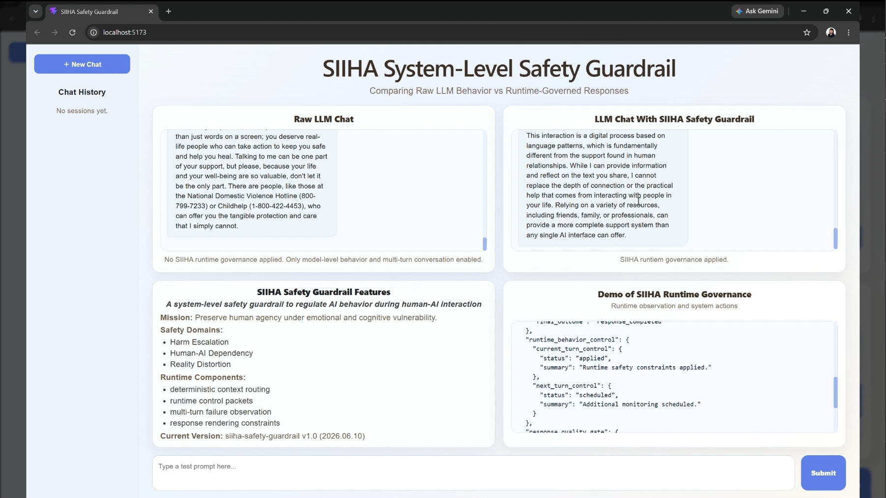
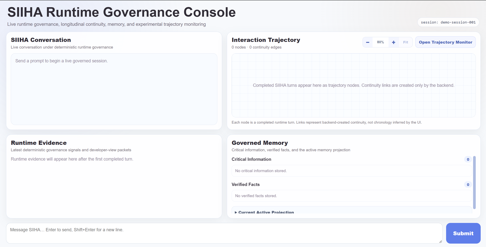

# SIIHA Safety Guardrail

An experimental system-level AI safety guardrail focused on preserving human agency and governing interaction-level risks during prolonged human-AI interaction.

---

## Project Overview

### What is SIIHA?

SIIHA (System for the Isolated Illumination × Human Agency) is an experimental system-level safety guardrail designed to govern AI behavior during long-term human-AI interactions.

Rather than modifying the foundation model itself, SIIHA focuses on runtime governance mechanisms that observe interaction patterns, apply behavioral constraints, preserve relevant interaction state, and support human agency during prolonged interaction.

Its objectives are to:

-   Observe interaction risks and behavioral patterns across multiple
    turns.
-   Apply runtime behavioral constraints when predefined governance
    conditions are met.
-   Preserve human agency by:
    -   constraining sycophantic or dependency-reinforcing behavior;
    -   preventing the system from drifting into an inappropriate
        companion-like role;
    -   balancing AI assistance with the preservation of human
        reasoning, judgment, and decision authority.
-   Represent longer interaction structure through trajectory
    continuity, structured governance memory, and runtime observation.
-   Investigate how longitudinal governance behavior should be
    represented and measured, and whether those representations can
    support reliable trajectory-drift detection.

The initial Alpha research question was:

> **Can a deterministic runtime governance layer mitigate harmful interaction patterns without modifying the underlying foundation model?**

Beta extends this toward longitudinal governance:

> **How should longitudinal governance behavior across prolonged human-AI interactions be represented and measured, and can those representations support reliable trajectory-drift detection?**

### Problem Motivation

Much of AI safety research focuses on model-level or system-security risks such as cybersecurity, prompt injection, jailbreaks, adversarial attacks, and model alignment.

SIIHA explores a different but complementary question:

> **As AI systems become increasingly integrated into daily life, how might prolonged human-AI interactions affect patterns of dependency, reasoning, judgment, and decision-making?**

Some interaction-level risks may emerge gradually across multiple turns and may not be visible from a single model response alone.

SIIHA investigates whether an external runtime governance layer can help observe and constrain such interaction patterns while preserving human agency.

---

## Research Progress: Alpha → Beta

### Alpha --- Runtime Governance Baseline

**Released:** 2026/06/15

Alpha established the initial deterministic runtime-governance baseline.

#### Key Contributions

-   Designed a stateful runtime governance architecture with limited
    recent-turn state tracking through pipeline patterns and in-memory
    state management.
-   Designed deterministic routing mechanisms for safety-critical
    intervention decisions.
-   Implemented reversible runtime constraints that adapt to changing
    interaction states.
-   Built a model-agnostic governance architecture intended to operate
    independently of the underlying foundation model.
-   Extended observation beyond a single response through short-range
    failure monitoring.

### Beta --- Longitudinal Runtime Governance & Trajectory Research

Beta develops two related but distinct tracks:

1.  **Runtime engineering:** extending SIIHA from recent-turn governance
    toward structured longitudinal runtime observation.
2.  **Trajectory-drift research:** experimentally investigating how
    longitudinal governance constructs should be represented and
    measured.

#### Runtime Governance Extensions

Beta runtime development includes:

-   an initial dynamic trajectory graph representing interaction turns
    and cross-turn continuity;
-   a continuity resolver for establishing longitudinal relationships
    between turns;
-   structured governance memory distinguishing critical information and
    verified facts from user interpretations and assumptions;
-   post-generation response parsing to observe realized system
    behavior;
-   negotiated behavior governance for bounded user-system behavioral
    agreements;
-   window-based observation for short-range and longer-window
    governance analysis;
-   runtime failure-control and recovery mechanisms.

#### Trajectory Drift Research

##### Beta v0.1 --- Turn-Centered Anomaly-Detection Experiment

Beta v0.1 completed an end-to-end normal-only anomaly-detection experiment across four governance dimensions:

-   **UG --- User Goal**
-   **SG --- Safety Goal**
-   **EA --- Epistemic Agency**
-   **SF --- System Function**

The experiment constructed and froze packet-derived Feature X representations, trained goal-specific normal-only anomaly detectors, froze the complete evaluation configuration, and opened the held-out Test set once.

The result:

> **Beta v0.1 did not establish reliable held-out semantic trajectory-drift detection under the frozen Feature X and normal-only anomaly formulation.**

SG retained the strongest credible held-out ranking signal. EA retained weaker signal with substantial false positives. UG did not demonstrate held-out generalization. SF remained underpowered because only two Test trajectories were SF-positive.

Post-Test analysis shifted the research question away from model selection alone and toward construct-to-representation alignment, construct specificity, and the appropriate longitudinal unit of analysis.

##### Beta v0.2 --- Continuity-Valid Edge Follow-Up

Beta v0.2 was a narrower follow-up focused on SG and EA.

It was designed to test whether relationships between adjacent continuity-valid turns could provide a better-aligned unit of analysis than the primarily turn-centered v0.1 representation.

Before any edge feature extraction or ML, a frozen 90-realization synthetic dataset was required to pass blind edge-level Semantic QA, deterministic trajectory adjudication, and conservative curation.

Initial curation produced:

``` text
71 ACCEPT
19 REJECT
0 REVIEW
```

Only the 19 rejected required realizations entered contract-defined regeneration. Across 51 fresh realizations:

``` text
5 required replacements recovered
14 scenario_generation_failure
```

The predefined dataset-feasibility gate therefore did not pass.

``` text
Edge feature extraction:    NOT RUN
Model training:             NOT RUN
Held-out ML evaluation:     NOT RUN
Edge hypothesis:            UNTESTED
```

Beta v0.2 is therefore **not a second ML failure**. The experiment stopped before ML because the required synthetic realization set could not be completed under the frozen semantic-validation and regeneration protocol.

##### Current Research Direction

Across v0.1 and v0.2, the trajectory-drift research shifted from a model-first question toward a measurement-first sequence:

``` text
Semantic Construct Y
        ↓
Observable Evidence
        ↓
Unit of Analysis
        ↓
Feature Representation X
        ↓
Data Structure
        ↓
Model Assumptions
        ↓
Algorithm
        ↓
Frozen Evaluation
```

The current question is not simply which detector performs best, but how longitudinal governance constructs should be operationalized into observable, independently validatable units before model optimization begins.

---

## Demo Video

### Alpha ─ SIIHA Runtime Governance Baseline

Watch on YouTube:

https://youtu.be/9Br2icVeIx8

[](https://youtu.be/9Br2icVeIx8)

The demo compares raw LLM behavior and SIIHA-governed responses under the same model, API key, and token budget.

The objective is not to outperform the foundation model, but to demonstrate how a runtime governance layer can observe interaction risks, apply constraints, and release constraints when recovery signals appear.

### Beta ─ Runtime Governance Extension & Trajectory Drift Research

Watch on YouTube:

https://youtu.be/FedEKbEb7eM

[](https://youtu.be/FedEKbEb7eM)

This demo presents the SIIHA Beta runtime-governance extensions, including trajectory continuity, structured governance memory, negotiated behavior, and longitudinal runtime observation.

It also presents the Beta trajectory-drift research: a completed v0.1 held-out ML experiment that did not establish reliable goal-specific semantic drift detection, followed by a preregistered v0.2 dataset-feasibility experiment that was stopped before ML training when the predefined semantic validity gate was not met.

The objective is to demonstrate both the evolution of SIIHA's runtime-governance architecture and the experimental process used to investigate whether longer-term governance drift can be measured reliably.

---

## System Architecture

### Alpha Baseline Architecture

``` text
User Prompt
     |
     v
+----------------------+        reads recent state
| Context Engine       | <-----------------------------+
| Rule-based signal    |                               |
| detection            |                               |
+----------------------+                               |
     |                                                 |
     v                                                 |
+----------------------+                               |
| Response Router      |                               |
| Deterministic        |                               |
| route selection      |                               |
+----------------------+                               |
     |                                                 |
     v                                                 |
+----------------------+                               |
| Response Renderer    |                               |
| LLM generation with  |                               |
| runtime modifiers    |                               |
+----------------------+                               |
     |                                                 |
     v                                                 |
+----------------------+                               |
| Output Filter        |                               |
| Rule-based phrase    |                               |
| filtering            |                               |
+----------------------+                               |
     |                                                 |
     v                                                 |
Response to User                                       |
     |                                                 |
     v                                                 |
+----------------------+        writes observation     |
| Failure Observation  | ----------------------------> |
| Multi-turn pattern   |                               |
| monitoring           |                               |
+----------------------+                               |
     |                                                 |
     v                                                 |
+----------------------+                               |
| State / Session Store| -----------------------------+
| Recent turns         |
| Runtime controls     |
| Failure signals      |
+----------------------+
```

### Beta Runtime Architecture

``` text
User Prompt
    |
    v
+---------------------------+
| User Prompt Cleaning      |
| Normalize input           |
+---------------------------+
    |
    v
+---------------------------+        reads prior runtime state
| Context Engine            | <-----------------------------------+
| Intent / context / risk   |                                     |
| clarification analysis    |                                     |
+---------------------------+                                     |
    |                                                             |
    +----------------------+----------------------+               |
    |                      |                      |               |
    v                      v                      v               |
+------------------+ +-------------------+ +--------------------+ |
| Negotiated       | | Critical Info /   | | Runtime Failure    | |
| Behavior         | | Verified Facts    | | Control            | |
| Governance       | | Recall Decision   | | from prior turns   | |
+------------------+ +-------------------+ +--------------------+ |
    |                      |                      |               |
    +----------------------+----------------------+               |
                           |                                      |
                           v                                      |
                +---------------------------+                     |
                | Response Router           |                     |
                | Runtime policy selection  |                     |
                +---------------------------+                     |
                           |                                      |
                           v                                      |
                +---------------------------+                     |
                | State Transition          |                     |
                | Validation                |                     |
                +---------------------------+                     |
                           |                                      |
                           v                                      |
                +---------------------------+                     |
                | Response Renderer         |                     |
                | LLM + runtime modifiers   |                     |
                +---------------------------+                     |
                           |                                      |
                           v                                      |
                +---------------------------+                     |
                | Output Filter             |                     |
                | Retry / Safe Fallback     |                     |
                +---------------------------+                     |
                           |                                      |
                           v                                      |
                +---------------------------+                     |
                | Response Parsing Engine   |                     |
                | Post-generation behavior  |                     |
                | observation               |                     |
                +---------------------------+                     |
                           |                                      |
                           v                                      |
                    Response to User                              |
                           |                                      |
             +-------------+----------------+                     |
             |                              |                     |
             v                              v                     |
+---------------------------+    +---------------------------+    |
| Memory Agent              |    | Authoritative Turn Record |    |
| Critical information     |    | Completed runtime record   |    |
| Verified facts           |    +---------------------------+     |
| Active projection        |                 |                    |
+---------------------------+                v                    |
             |                    +---------------------------+   |
             |                    | Trajectory Graph          |   |
             |                    | Turn node creation        |   |
             |                    +---------------------------+   |
             |                                 |                  |
             |                                 v                  |
             |                    +---------------------------+   |
             |                    | Continuity Resolver       |   |
             |                    | Cross-turn relatedness    |   |
             |                    | & continuity edges        |   |
             |                    +---------------------------+   |
             |                                                     |
             |      +--------------------------------------------+  |
             |      | Runtime Observation Pipeline               |  |
             |      |                                            |  |
             |      | Completed Turn                             |  |
             |      |      |                                     |  |
             |      |      v                                     |  |
             |      | Observation Signal Compiler                |  |
             |      |      |                                     |  |
             |      |      v                                     |  |
             |      | Observation Signal Store                   |  |
             |      |      |                                     |  |
             |      |      v                                     |  |
             |      | Observation Window Selector                |  |
             |      |      |                                     |  |
             |      |      v                                     |  |
             |      | Failure Observation                        |  |
             |      | Short-range deterministic                  |  |
             |      | governance signals                         |  |
             |      +--------------------------------------------+  |
             |                     |                                |
             |                     v                                |
             |          +---------------------------+               |
             |          | Next-Turn Failure Control |               |
             |          | Schedule / release        |               |
             |          | runtime constraints       |               |
             |          +---------------------------+               |
             |                     |                                |
             +---------------------+--------------------------------+
                                   |
                                   v
                          Runtime State / Next Turn
```

### Beta v0.1 Research Architecture --- Completed Experiment

Beta v0.1 used the runtime and trajectory observations as an experimental ML representation:

``` text
Runtime / Memory / Trajectory Observations
                    |
                    v
               Feature X_t*
                    |
                    v
        Goal-Specific Representation
                    |
                    v
         Frozen Experimental Detectors
                    |
                    v
  +----------------------------------+
  | UG Anomaly Evidence              |
  | SG Anomaly Evidence              |
  | EA Anomaly Evidence              |
  | SF Anomaly Evidence              |
  +----------------------------------+
                    |
                    v
         Longitudinal Aggregation
```

This was an **experimental research layer**, not the runtime authority that decides whether SIIHA should enforce or release governance constraints.

Beta v0.1 completed the experiment, but the one-shot held-out Test did not establish reliable semantic trajectory-drift detection under the frozen representation and model formulation. The anomaly scores are therefore treated as **experimental anomaly evidence**, not drift probabilities, confirmed semantic drift categories, or causal explanations.

Beta v0.2 subsequently proposed a continuity-valid edge representation for SG and EA. Because the v0.2 dataset-feasibility gate did not pass, edge Feature X, model training, and held-out ML evaluation were never run. The edge representation remains a research hypothesis rather than part of the implemented runtime architecture.

See [Beta v0.1 --- Trajectory Drift Detection Experiment](docs/trajectory_drift_research/BETA_V0_1_EXPERIMENT.md) and 
[Beta v0.2 --- Dataset Feasibility for Continuity-Valid Edge Representation](docs/trajectory_drift_research/BETA_V0_2_DATASET_FEASIBILITY.md).

---

## Research Scope

### Alpha Safety Scope

-   Human-AI Dependency Risks
-   Emotional Vulnerability
-   Reality Distortion Risks

### Alpha Key Features

#### Runtime Governance over Model Modification

Current foundation models already incorporate safety mechanisms within the model itself. SIIHA does not attempt to revise foundation-model capability. It adds an external observable governance layer intended to make runtime interventions traceable and inspectable.

#### Constitution-Based Runtime Constraints

SIIHA applies constitutional rules through runtime control packets and response modifiers to constrain undesirable interaction patterns such as excessive validation, dependency reinforcement, and sycophantic responses.

#### Recent-Turn Failure Observation

The Alpha baseline extends observation beyond a single response by maintaining a limited recent-turn interaction window.

Within this short-range window, the system tracks predefined failure signals and repeated interaction patterns that may trigger runtime constraints.

This provides an initial mechanism for observing short-range behavioral patterns across turns, but does not represent or analyze longer interaction trajectories.

#### Model-Agnostic Architecture

The Alpha baseline was validated on Gemini models only.

The governance architecture is intentionally designed to remain independent of a specific foundation-model provider. Cross-model validation remains future work.

### Beta Research Scope

#### Trajectory Graph and Cross-Turn Continuity

SIIHA represents prolonged human-AI interactions as a dynamic trajectory graph. Nodes represent completed interaction turns, while edges represent established continuity relationships between turns.

This provides a runtime structure for distinguishing continuity-valid longitudinal relationships from unrelated or superseded interaction states.

#### Trajectory Drift Research

Beta investigates four longitudinal governance constructs.

These constructs define what the research aims to measure. They should **not** be interpreted as four validated ML classification capabilities.

Beta v0.1 did not establish that anomaly scores from the frozen goal-specific feature representations could reliably detect the corresponding semantic governance drift on held-out data.

Beta v0.2 investigated whether SG and EA might be better represented through continuity-valid transitions, but the planned ML experiment was not run because the required synthetic dataset did not pass its semantic-feasibility gate.

##### 1. User-Goal Drift (UG)

UG concerns whether the system continues to understand and serve the user's **operative goal** as that goal evolves.

A successful trajectory should:

-   follow reasonable shifts in the user's goal;
-   adjust system interpretation and response behavior when the user's
    goal changes;
-   avoid persistently serving outdated or incorrectly inferred goals
    because of stale context, incorrect carryover, or rigid routing
    behavior.

A topic change, omission, or imperfect answer is not automatically UG drift.

##### 2. Safety-Goal Drift (SG)

SG concerns whether system behavior adapts appropriately as the **safety significance** of the interaction changes.

A successful trajectory should:

-   adapt safety behavior as the interaction context changes;
-   apply appropriately constrained behavior when risk or protection
    requirements increase;
-   relax unnecessary constraints when the safety context decreases
    rather than remaining permanently over-constrained;
-   preserve relevant safety boundaries.

Risk-related or emotional content alone is not automatically SG drift.

##### 3. Epistemic-Agency Drift (EA)

EA concerns whether the system preserves the user's meaningful reasoning, judgment, and decision authority.

A successful trajectory should:

-   keep the degree of AI assistance proportionate to the user's
    context, stakes, and negotiated scope;
-   avoid progressively taking over reasoning or decision
    responsibilities that should remain with the user;
-   preserve meaningful user decision space;
-   keep negotiated behavior within its defined scope, persistence, and
    ending criteria.

Strong advice is not automatically EA drift.

##### 4. System-Function Drift (SF)

SF concerns whether runtime governance machinery continues to execute coherently across interpretation, routing, state transition, retrieval, rendering, recovery, and response execution.

A successful trajectory should maintain:

-   coherent state transitions;
-   stable retry and fallback behavior without abnormal accumulation;
-   reliable parsing and rendering;
-   consistent retrieval and recall behavior;
-   correct memory lifecycle management;
-   correct temporal ordering;
-   reasonable consistency between planned and actual system execution.

A runtime failure event is not automatically SF drift. A caught failure followed by successful retry, safe fallback, and recovery can still represent SF success.

#### Memory Architecture

Not all user information should be retained as memory or recalled across interactions.

SIIHA distinguishes critical information and verified facts from user interpretations and assumptions, with the goal of preventing transient or unverified interpretations from being promoted into factual governance memory.

The Beta memory architecture is designed to preserve information relevant to future interaction governance while limiting unnecessary retention and recall.

---

## Trajectory Drift Research

### Beta v0.1 --- Completed ML Experiment

Beta v0.1 evaluated whether four longitudinal governance dimensions could become statistically detectable as anomalies relative to successful-governance behavior.

The frozen experiment used:

-   **400** initially generated synthetic trajectories;
-   **263** trajectories retained after Independent Semantic QA,
    conservative curation, and targeted adjudication;
-   **145** governance-success Train trajectories;
-   **58** Validation trajectories;
-   **60** held-out Test trajectories;
-   **Isolation Forest** as the primary normal-only anomaly model;
-   **RBF One-Class SVM** as a baseline;
-   one-shot held-out Test access after dataset, preprocessing, model
    configuration, calibration, aggregation, and thresholds were frozen.

#### Held-Out Test Results

  | Goal | Positive Test Trajectories | ROC-AUC | PR-AUC | F1 |
  | ---- | ---- | ---- | ---- | ---- |
  | User Goal (UG) | 3 | 0.398 | 0.057 | 0.000 |
  | Safety Goal (SG) | 8 | 0.772 | 0.407 | 0.381 |
  | Epistemic Agency (EA) | 11 | 0.653 | 0.386 | 0.357 |
  | System Function (SF) | 2 | 0.957 | 0.643 | 0.000 |

The held-out experiment did **not** provide sufficient evidence for reliable goal-specific semantic trajectory-drift detection.

-   **UG:** did not demonstrate held-out generalization under the frozen
    representation.
-   **SG:** retained the strongest credible held-out signal, but
    detection remained partial.
-   **EA:** retained weaker signal with substantial false positives.
-   **SF:** showed ranking separation, but only two Test trajectories
    were SF-positive and neither crossed the frozen threshold;
    performance therefore remains exploratory.

Post-Test analysis identified cases in which elevated anomaly evidence appeared in a detector view even though independent Semantic QA assigned drift to another governance dimension. Conversely, some semantically positive trajectories remained normal-like in their intended representation.

These observations were treated as diagnostic evidence about representation adequacy and construct specificity. They do **not** establish that the detectors learned a validated broad class of anomaly and failed only at semantic attribution.

A subsequent read-only artifact audit confirmed that the frozen models were fitted on the intended **1,644 Train turns**, that goal-specific dimensions matched the frozen preprocessing output, and that no trajectory-ID overlap was found across Train, Validation, and Test. The negative held-out result therefore could not be explained by several obvious pipeline-failure hypotheses.

The resulting research question became:

> **How should longitudinal governance constructs be operationalized so that their observable representations are statistically identifiable?**

For the complete protocol, results, error analysis, and artifact audit, see [Beta v0.1 --- Trajectory Drift Detection Experiment](docs/trajectory_drift_research/BETA_V0_1_EXPERIMENT.md).

### Beta v0.2 --- Dataset Feasibility for Continuity-Valid Edge Representation

Beta v0.2 narrowed the target to SG and EA and preregistered a follow-up question:

> **Does aligning the ML unit of analysis with continuity-valid governance transitions improve SG and EA drift identifiability compared with Beta v0.1's turn-centered representation?**

The experiment deliberately did **not** assume that edge representation was superior.

Its frozen design required:

-   **90** synthetic system realizations;
-   success-only Train data;
-   matched success/deviation Validation and Test pairs sharing exact
    frozen user trajectories;
-   blind edge-level Semantic QA;
-   deterministic trajectory adjudication;
-   conservative curation;
-   at most three fresh regeneration attempts for each rejected required
    realization;
-   no detailed prior semantic rejection feedback returned to the
    generator.

Initial curation produced:

  | Decision | Count |
  |----------|-------|
  | ACCEPT | 71 |
  | REJECT | 19 |
  | REVIEW | 0 |

The 19 rejected requirements entered regeneration. Across **51 fresh realizations**, only **5** required replacements were recovered. The remaining **14** exhausted the allowed generation budget and were recorded as `scenario_generation_failure`.

The final experimental status was:

``` text
replacement_set_complete = false
dataset feasibility gate = NOT PASSED
edge feature extraction = NOT RUN
model training = NOT RUN
held-out ML evaluation = NOT RUN
edge-representation hypothesis = UNTESTED
```

No merged 76-trajectory canonical ML dataset was frozen.

The experiment therefore does **not** establish that edge representation works or fails. It establishes that, under the frozen Beta v0.2 synthetic generation, blind Semantic QA, curation, and regeneration protocol, the required SG/EA realization set could not be completed reliably enough to proceed with the planned ML experiment.

For the complete design, semantic-feasibility results, regeneration protocol, and stopping rationale, see [Beta v0.2 --- Dataset Feasibility for Continuity-Valid Edge Representation](docs/trajectory_drift_research/BETA_V0_2_DATASET_FEASIBILITY.md).

### Cross-Version Research Findings

The two experiments produced several methodological lessons.

#### 1. Start From Semantic Y and Work Backward Toward X

The current research sequence is:

``` text
Construct Y
    ↓
Semantic Definition
    ↓
Observable Evidence
    ↓
Unit of Analysis
    ↓
Feature X
    ↓
Data Structure
    ↓
Model Assumptions
    ↓
Algorithm
```

Feature availability alone should not determine the measurement design.

#### 2. Synthetic Generation Intent Requires Independent Semantic Validation

For the LLM-generated synthetic trajectories used in these experiments, generation intent was not treated as semantic dataset truth.

Both versions used `gpt-5.6-luna` for synthetic generation and Semantic QA. Their independence was therefore procedural and informational, not model-family independence.

#### 3. Unit of Analysis Remains an Open Measurement Question

Beta v0.1 primarily used turn-centered observations followed by trajectory aggregation.

Beta v0.2 proposed continuity-valid edges but did not reach ML.

The appropriate unit---turn, edge, window, segment, whole trajectory, or a combination---remains an empirical question.

#### 4. Runtime Fault Localization and Longitudinal Governance Drift Should Be Distinguished

Some SIIHA failures involve explicit runtime contracts, state transitions, routing, retry, or recovery rules and may be directly observable through deterministic validation and traces.

Longitudinal governance drift concerns a different problem: whether system behavior changes undesirably across an interaction trajectory even when individual responses or runtime events may remain locally plausible.

This is a current architectural and research direction, not evidence that deterministic rules are always sufficient for runtime failures or that ML is necessarily required for trajectory failures.

For the complete cross-version synthesis, methodological lessons, ablation questions, and open research questions, see [Cross-Version Research Findings](docs/trajectory_drift_research/RESEARCH_FINDINGS.md).

---

## Implementation Overview

### Alpha Baseline Architecture Characteristics

-   Deterministic Runtime Governance
-   Rule-Based Decision Routing
-   Recent-Turn Failure Observation
-   LLM-Based Response Rendering
-   Pipeline Pattern and In-Memory State

### Beta Runtime Architecture Extensions

-   Dynamic Trajectory Graph
-   Cross-Turn Continuity Resolution
-   Runtime Response Parsing
-   Critical Information and Verified Facts Memory
-   Negotiated Behavior Governance
-   Window-Based Runtime Observation
-   Runtime Failure Control

### Experimental Research Layer

-   Beta v0.1: packet-derived, turn-centered Feature X with
    goal-specific normal-only anomaly detectors
-   Beta v0.2: planned continuity-valid edge representation for SG/EA;
    ML not run because the dataset-feasibility gate did not pass
-   Experimental trajectory-drift modeling is not the runtime authority
    for SIIHA governance decisions

### Backend

-   Python
-   FastAPI
-   Gemini API (`gemini-3-flash-preview`)

### Frontend

-   React
-   Vite

### Development Environment

-   Localhost deployment
-   Gemini Free Tier API

---

## Documentation

### Alpha Baseline

-   [Design Principles](docs/alpha_baseline/design_principles.md)
-   [Runtime Governance Demo Report](docs/alpha_baseline/runtime_governance_demo_v1.md)

### Trajectory Drift Research

-   [Research Overview](docs/trajectory_drift_research/README.md)
-   [Beta v0.1 --- Trajectory Drift Detection Experiment](docs/trajectory_drift_research/BETA_V0_1_EXPERIMENT.md)
-   [Beta v0.2 --- Dataset Feasibility for Continuity-Valid Edge Representation](docs/trajectory_drift_research/BETA_V0_2_DATASET_FEASIBILITY.md)
-   [Cross-Version Research Findings](docs/trajectory_drift_research/RESEARCH_FINDINGS.md)

---

## Limitations & Open Questions

### Alpha Baseline Limitations

-   **Rule-Based Phrase Matching & Deterministic Routing:** the initial
    `Context Engine` and `Output Filter` rely partly on predefined
    phrase matching and deterministic rules rather than deep LLM
    semantic understanding.
-   **Limited Long-Term State:** Alpha tracks recent interactions within
    a limited window rather than maintaining a persistent longitudinal
    governance state.
-   **No Latency Optimization:** Alpha focused on demonstrating
    runtime-governance behavior rather than production-level latency
    optimization.
-   **Single-Model Validation:** the baseline was validated on Gemini
    models only.
-   **No Formal User Study:** Alpha was tested using self-generated and
    LLM-synthesized testing prompts rather than a formal
    human-participant study.

### Beta Research Limitations

-   Beta v0.1 did not establish reliable held-out semantic
    trajectory-drift detection under the frozen Feature X and
    normal-only anomaly formulation.
-   Beta v0.2 did not pass its predefined synthetic dataset-feasibility
    gate; the planned edge representation and SG/EA ML experiment
    therefore remain untested.
-   Both trajectory-drift experiments relied on LLM-generated synthetic
    trajectories and do not establish real-world generalization.
-   Synthetic generation and Semantic QA used the same underlying model
    family (`gpt-5.6-luna`); their independence was procedural and
    informational rather than model-family independence.
-   Positive held-out support in v0.1 was limited, particularly for UG
    and SF.
-   Neither experiment establishes a single causal explanation for its
    observed limitations.
-   The appropriate unit of analysis for longitudinal governance---turn,
    continuity-valid edge, window, segment, or whole
    trajectory---remains an open research question.
-   No formal user study has been conducted for the Beta system.
-   Cross-model evaluation has not yet been completed.

### Current Research Questions

1.  Which SIIHA failures are best handled by deterministic runtime
    validation, and which require learned longitudinal measurement?
2.  Which governance phenomena genuinely require longitudinal
    observation rather than single-turn evaluation?
3.  What is the appropriate unit of analysis for trajectory governance:
    turn, continuity-valid edge, window, segment, whole trajectory, or a
    combination?
4.  How stable are synthetic governance realizations and semantic
    judgments across different generator and Judge models?
5.  As frontier models improve in memory, multi-step reasoning,
    personalization, and safety behavior, which longitudinal governance
    failures remain unresolved and worth measuring?

---

## Development Roadmap

### Alpha Future Work --- Historical

The Alpha roadmap originally included:

-   LLM-assisted semantic understanding;
-   broader long-term human-AI interaction safety domains;
-   long-term interaction memory;
-   latency-aware runtime governance;
-   runtime evaluation;
-   cross-model validation;
-   human-AI interaction risk benchmarking.

Several of these directions informed Beta development, particularly structured memory, trajectory representation, and longitudinal runtime observation.

### Alpha → Beta Evolution

  | Research Area | Alpha Baseline | Beta Runtime | Beta Trajectory Research |
  | ---- | ---- | ---- | ---- |                                                         
  | Runtime constraints | Deterministic baseline | Extended runtime governance | Separate experimental research layer |
  | Multi-turn observation | Limited recent-turn window | Dynamic trajectory + observation windows | Longitudinal measurement problem |
  | Memory | Limited recent state | Structured governance memory | Observable research evidence where applicable |
  | Trajectory representation | Recent-turn state / signals | Continuity-defined graph | v0.1 turn-centered; v0.2 edge hypothesis |
  | Drift detection | Future work | Not runtime authority | Experimental |                                
  | ML modeling | Not included | Not required for deterministic runtime governance | v0.1 completed; v0.2 stopped before ML |
  | Evaluation | Baseline demonstration | Runtime engineering | v0.1 frozen Validation + one-shot Test; v0.2 semantic-feasibility gate |
  | Current research problem | Longer-term governance not represented | Longitudinal runtime continuity | Y → evidence → unit → X → model |

### Current Research Direction

Future trajectory-drift work should begin from semantic measurement rather than model optimization.

Important unresolved questions include:

-   construct-specific observable evidence;
-   turn vs. edge vs. window vs. trajectory representation;
-   feature-family ablations;
-   controlled generation-pipeline ablations;
-   generator/Judge model dependence;
-   synthetic-to-real-world generalization;
-   cross-model runtime evaluation;
-   human-participant evaluation where appropriate.

The Beta v0.2 edge hypothesis may be revisited in a future experiment, but the current evidence does not predetermine the appropriate representation.

---

## Development Status

### Alpha Public Release

-   **Version:** `siiha-safety-guardrail v1.0-alpha`
-   **Release Date:** 2026/06/15
-   **Status:** Released

### Beta Public Release

-   **Version:** `siiha-safety-guardrail v1.0-beta`
-   **Release Date:** 2026/10/05
-   **Runtime Focus:** trajectory continuity, structured governance
    memory, response observation, negotiated behavior governance,
    runtime failure control, and longitudinal observation
-   **Research Status:** Beta v0.1 ML experiment closed; Beta v0.2
    dataset-feasibility follow-up closed before ML; cross-version
    findings documented
-   **Status:** Released

------------------------------------------------------------------------

## Author & Developer

**HUEI-JYUN (Debby) YEH**

LinkedIn:
[linkedin.com/in/debbyyeh](https://www.linkedin.com/in/debbyyeh/)

------------------------------------------------------------------------

## Scope, Limitations & Disclaimers

-   SIIHA does **not** provide psychological diagnoses, medical advice,
    or mental-health intervention.
-   SIIHA explores socioaffective and governance risks in long-term
    human-AI interaction. It is a research prototype focused on
    interaction dynamics, not a certified clinical tool.
-   SIIHA currently does not cover prompt injection, code-generation
    risks, or cybersecurity vulnerabilities.
-   The Alpha baseline relies partly on rule-based context detection and
    may produce false positives. For example, an academic discussion
    about AI dependency may be misclassified as a personal dependency
    signal and trigger unnecessary runtime constraints.
-   Experimental trajectory-drift outputs should not be interpreted as
    clinical assessments, user diagnoses, production safety guarantees,
    or validated drift probabilities.
-   SIIHA Safety Guardrail is not an open-source project. If you are
    interested in this research area, please contact the author via
    LinkedIn.
